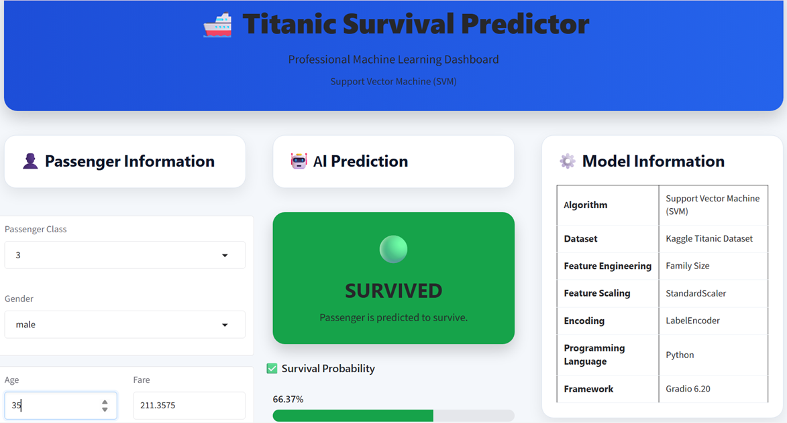

# 🚢 Titanic Survival Prediction using Support Vector Machine (SVM)

An end-to-end **Machine Learning** project that predicts whether a passenger would survive the Titanic disaster using a **Support Vector Machine (SVM)** classifier. The project includes data preprocessing, feature engineering, model training, evaluation, and deployment through an interactive **Gradio** web application.

---

## 📸 Dashboard Preview



---

# 📌 Project Overview

The sinking of the RMS Titanic is one of the most well-known maritime disasters in history. Using passenger information such as age, gender, ticket class, fare, and family size, this project predicts whether a passenger was likely to survive.

The objective of this project is to demonstrate a complete **Machine Learning workflow**, from raw data to an interactive prediction application.

---

# ✨ Features

- ✅ Data Cleaning & Preprocessing
- ✅ Exploratory Data Analysis (EDA)
- ✅ Feature Engineering
- ✅ Feature Encoding
- ✅ Feature Scaling using StandardScaler
- ✅ Support Vector Machine (SVM) Classifier
- ✅ Hyperparameter Tuning
- ✅ Model Evaluation
- ✅ Model Serialization using Joblib
- ✅ Interactive Gradio Web Application
- ✅ Real-time Passenger Survival Prediction
- ✅ Professional Dashboard Interface

---

# 🤖 Machine Learning Workflow

```
Raw Dataset
      │
      ▼
Data Cleaning
      │
      ▼
Feature Engineering
      │
      ▼
Encoding
      │
      ▼
Feature Scaling
      │
      ▼
SVM Model Training
      │
      ▼
Model Evaluation
      │
      ▼
Save Trained Model (.pkl)
      │
      ▼
Gradio Web Application
      │
      ▼
Real-time Prediction
```

---

# 📂 Project Structure

```
Titanic-Survival-SVM
│
├── app.py                     # Gradio Web Application
├── README.md
├── requirements.txt
├── LICENSE
├── .gitignore
│
├── data
│   ├── raw
│   │   └── train.csv
│   └── processed
│
├── images
│   └── dashboard.png
│
├── models
│   ├── titanic_svm_model.pkl
│   ├── standard_scaler.pkl
│   ├── sex_encoder.pkl
│   └── embarked_encoder.pkl
│
├── notebooks
│   └── Titanic_SVM_Project.ipynb
│
└── test_model.py
```

---

# 📊 Dataset

**Dataset:** Titanic Dataset

**Target Variable**

- Survived

**Input Features**

- Passenger Class (Pclass)
- Gender (Sex)
- Age
- Number of Siblings/Spouses (SibSp)
- Number of Parents/Children (Parch)
- Fare
- Port of Embarkation (Embarked)
- Family Size (Engineered Feature)

---

# 🧠 Machine Learning Model

**Algorithm**

Support Vector Machine (SVM)

### Feature Engineering

A new feature was created:

```
Family Size = SibSp + Parch + 1
```

### Data Preprocessing

- Missing value handling
- Label Encoding
- Standard Feature Scaling
- Feature Engineering
- Data Transformation

### Model Files

The trained model and preprocessing objects are stored inside the **models** directory.

- `titanic_svm_model.pkl`
- `standard_scaler.pkl`
- `sex_encoder.pkl`
- `embarked_encoder.pkl`

---

# 🛠️ Technologies Used

| Technology | Purpose |
|------------|---------|
| Python | Programming Language |
| Pandas | Data Manipulation |
| NumPy | Numerical Computing |
| Scikit-learn | Machine Learning |
| Joblib | Model Serialization |
| Gradio | Web Application |
| Git | Version Control |
| GitHub | Project Hosting |

---
# ⚙️ Installation

## Clone the Repository

```bash
git clone https://github.com/engrjamalakram/Titanic-Survival-SVM.git
```

Navigate to the project directory:

```bash
cd Titanic-Survival-SVM
```

---

## Install Dependencies

```bash
pip install -r requirements.txt
```

---

# ▶️ Running the Application

Launch the Gradio web application:

```bash
python app.py
```

The application will start locally and can be accessed through your web browser.

---

# 💻 Using the Application

1. Select the passenger class.
2. Choose the passenger gender.
3. Enter the passenger age.
4. Enter the ticket fare.
5. Enter the number of siblings/spouses.
6. Enter the number of parents/children.
7. Select the port of embarkation.
8. Click **Predict Survival**.
9. View the predicted outcome along with the survival and non-survival probabilities.

---

# 📈 Model Prediction Pipeline

The prediction process follows these steps:

```
Passenger Input
        │
        ▼
Label Encoding
        │
        ▼
Family Size Calculation
        │
        ▼
Standard Feature Scaling
        │
        ▼
Support Vector Machine (SVM)
        │
        ▼
Prediction
        │
        ▼
Probability Scores
        │
        ▼
Interactive Dashboard
```

---

# 📁 Saved Model Files

The application loads the following pre-trained objects during startup:

| File | Description |
|------|-------------|
| titanic_svm_model.pkl | Trained SVM classifier |
| standard_scaler.pkl | Feature scaler |
| sex_encoder.pkl | Label encoder for Gender |
| embarked_encoder.pkl | Label encoder for Port of Embarkation |

---

# 🎯 Project Highlights

- End-to-end Machine Learning workflow
- Clean and modular Python code
- Feature Engineering
- Interactive Gradio Dashboard
- Probability-based predictions
- Reusable trained model
- Git version control
- GitHub portfolio project

---

# 🔮 Future Improvements

Potential future enhancements include:

- Random Forest and XGBoost comparison
- Deep Learning implementation
- Docker deployment
- Streamlit version
- Model explainability using SHAP
- Cloud deployment on Hugging Face Spaces
- REST API using FastAPI
- Improved visualizations and analytics

---

# 📜 License

This project is licensed under the **MIT License**.

See the [LICENSE](LICENSE) file for more information.

---

# 👨‍💻 Author

**Jamal Akram**

Machine Learning Enthusiast | Electrical Engineer | AI Learner

GitHub:

https://github.com/engrjamalakram

---

# ⭐ Support

If you found this project helpful, please consider giving it a **⭐ Star** on GitHub.

It helps others discover the project and motivates further development.

---

## 🙏 Acknowledgements

- Kaggle for providing the Titanic dataset.
- The Scikit-learn community for the machine learning framework.
- The Gradio team for making ML application deployment simple and interactive.
- The Python open-source community for the amazing ecosystem.

---

## 📬 Contact

If you have any questions, suggestions, or feedback regarding this project, feel free to connect through GitHub.

---

**Thank you for visiting this repository! 🚢**